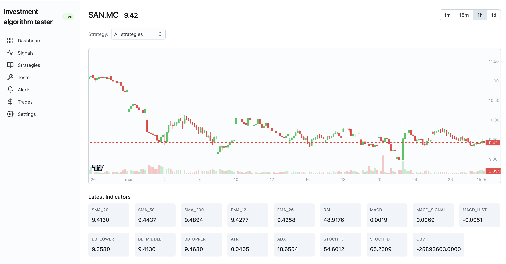
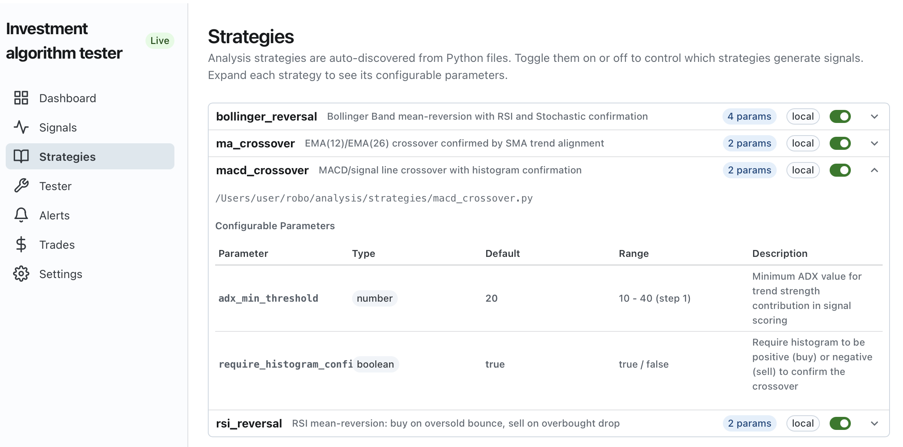
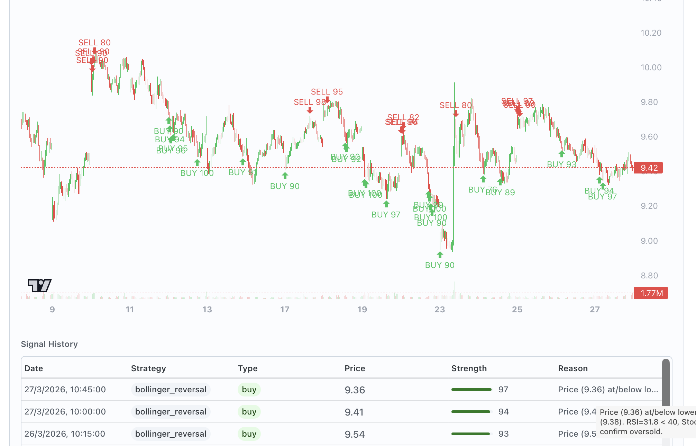
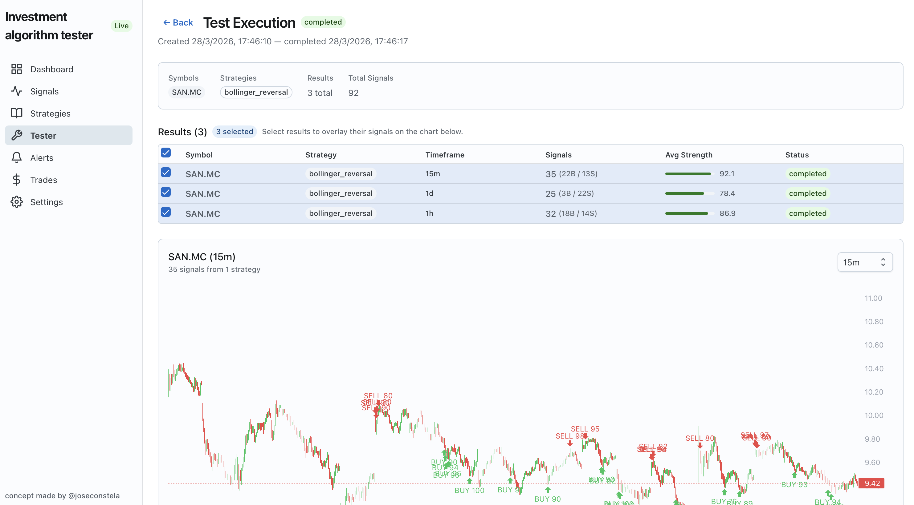

# Strategy Tester - Stock Trend Detection System

> Stock trend detection with technical analysis, algorithm tester, multi-timeframe signals, and (in future) trade approval workflows.

](docs/screenshots/general_view.png)

## Screenshots

| | |
|---|---|
| [](docs/screenshots/general_view.png) | [](docs/screenshots/strategies_list.png) |
| General View | Strategies List |
| [](docs/screenshots/signals_result.png) | [](docs/screenshots/tester_results.png) |
| Signals Result | Tester Results |

## Prerequisites

- **Docker** (for MongoDB and Redis)
- **Node.js** >= 22
- **Python** >= 3.10

## Quick Start

```bash
# 1. Install Node.js dependencies
npm install
npm install --prefix backend
npm install --prefix frontend

# 2. Set up the Python analysis service
npm run analysis:setup

# 3. Start everything
npm run dev:full
```

That's it. This starts all four services:

| Service | Label | URL | Description |
|---------|-------|-----|-------------|
| MongoDB + Redis | `db` | `localhost:27018` / `localhost:6380` | Docker containers |
| Backend API | `api` | `http://localhost:3001` | Express + Socket.IO |
| Frontend | `app` | `http://localhost:5173` | React dashboard |
| Analysis | `analysis` | — | Python trend detection engine |

Open **http://localhost:5173** in your browser.

## npm Scripts

| Command | Description |
|---------|-------------|
| `npm run dev` | Start DB, backend, and frontend only (no analysis) |
| `npm run dev:full` | Start everything including the Python analysis service |
| `npm run dev:db` | Start MongoDB and Redis containers |
| `npm run dev:backend` | Start the Express backend |
| `npm run dev:frontend` | Start the Vite dev server |
| `npm run dev:analysis` | Start the Python analysis service |
| `npm run analysis:setup` | Create Python venv and install dependencies |

## First Steps

1. Open the dashboard at `http://localhost:5173`
2. Go to **Settings** and add a symbol to the watchlist (e.g. `TSLA`, `AAPL`, or `ASML.AS` for European stocks)
3. The analysis service fetches historical data from Yahoo Finance every 2 minutes
4. Signals, indicators, and candle data will appear on the **Dashboard** and **Ticker Detail** pages

> **Note:** European stocks use exchange suffixes: `.AS` (Amsterdam), `.L` (London),
> `.DE` (Frankfurt), `.PA` (Paris), `.MC` (Madrid), `.MI` (Milan), `.SW` (Swiss).

## Project Structure

```
Strategy-Tester/
├── backend/          Node.js Express API + Socket.IO
│   └── src/
│       ├── config/       DB connection
│       ├── models/       Mongoose schemas (Price, Signal, Alert, Trade, Watchlist)
│       ├── routers/      REST API routes
│       └── services/     Redis pub/sub, Socket.IO bridge
├── frontend/         React + MUI Joy dashboard
│   └── src/
│       ├── components/   Layout, SignalFeed, TradeApproval
│       ├── context/      Socket.IO provider
│       ├── hooks/        useApi, useSocket
│       └── pages/        Dashboard, TickerDetail, Signals, Alerts, Trades, Settings
├── analysis/         Python analysis microservice
│   ├── main.py           Entry point + scheduler
│   ├── fetcher.py        Yahoo Finance data fetching
│   ├── indicators.py     Technical indicator computation (pandas-ta)
│   ├── strategies.py     Signal generation strategies
│   ├── analyzer.py       Multi-timeframe orchestrator
│   ├── publisher.py      Redis signal publisher
│   ├── db.py             MongoDB helpers
│   └── config.py         Configuration
├── docker-compose.yml
├── ARCHITECTURE.md   Detailed architecture and extensibility guide
└── package.json      Root orchestrator scripts
```

## Troubleshooting

### Analysis service won't start

```bash
# Recreate the venv from scratch
cd analysis
rm -rf venv
python3 -m venv venv
./venv/bin/pip install -r requirements.txt
```

### No data appearing after adding a symbol

The Python analysis service must be running. Use `npm run dev:full` instead of `npm run dev`. After adding a symbol, data will appear within 2 minutes (the fetch cycle interval).

### Docker containers not starting

```bash
docker compose up -d    # start in background
docker compose logs     # check for errors
```

### Port conflicts

Default ports: MongoDB `27018`, Redis `6380`, Backend `3001`, Frontend `5173`. Change them in:
- `docker-compose.yml` for DB ports
- `backend/.env` for backend port and connection strings
- `analysis/.env` for Python service connection strings
